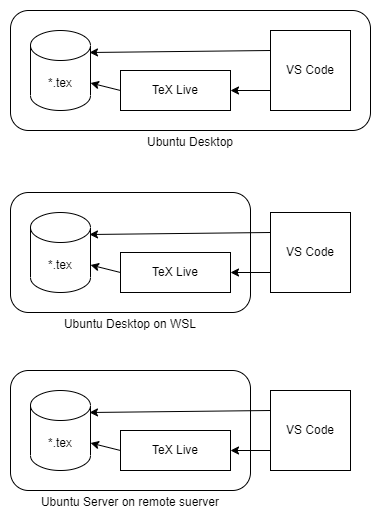

# PaleALE
PaleALE : Pale - A Latex Environmentは、Visual Studio Codeエディタを使う
LaTeX執筆環境の構築用スクリプト、ツール、およびサンプルLaTeX文書の
コレクションです
## 概要
PaleALEプロジェクトの目的は二つあります。
- Visual Sudio CodeによるLaTeX執筆環境を作るためのインストール・スクリプトを提供する
- 同環境での執筆のためのツールを提供する

PaleALEが構築する執筆環境はVisual Studio Codeと、その上で動作するLaTeX Workshopプラグインを用いたものです。LaTeX Workshopを使うことで、LaTeXファイルを保存するたびにビルドが自動的に行われ、Visual Studio Code上で即座に生成したPDFファイルが自動的に表示されます。執筆者はビルドのたびにコマンドを叩く必要はありません。

LaTeXは美しい文書を作ることが出来るツールですが、文献の整理や画像の挿入といった事を始めると、非常に多くのツールとの連携が必要になってきます。これらのツールを使う環境の準備や、手作業によるツールの起動を行っていては執筆に集中できません。

PaleALEは環境の手軽な設定と、画像をLaTeX文書を使うためのスクリプトを提供します。具体的にはスクリプトを使うことで以下の画像形式をLaTeX上でPDFとして利用できるようになります。
- PDF
- PNG
- GIF
- JPEG
- draw.io

PDF以外の画像はスクリプトによってPDFに変換されます。変換はマルチプロセスで行いますので、大量の画像データがある場合もマルチコア・プロセッサを利用して手早く変換をすることが出来ます。

画像の変換はLaTeXのビルド・シーケンスに組み込まれているため、手作業で変換スクリプトを呼ぶ必要はありません。

## 試験環境

PaleALEのスクリプトは以下の環境で試験しています。
- Visual Studio Code on Ubuntu Desktop 22.04 LTS
- Ubuntu Desktop 22.04 LTS on WSL + Visual Studio Code on Windows 11 (VS Code Remote connection)
- Ubuntu Server 22.04 LTS on VMware + Visual Studio Code on Windows 11 (SSH connection)

<div align="center">

</div>

## 使い方
LaTeXの執筆を行うには、まず[LaTeX文書のプロジェクト](FILES.md)をVisual Studio Codeで開きます(メニューバー→[File]→[Open Folder ...])。この状態で編集を行います。Visual Sutdio Codeはフォルダのファイル一覧を表示してくれるので、好きなファイルを自由に開くことが出来ます。

LaTeX文書のソース・ファイル(.tex)を開いた状態で以下のショートカットを利用できます。
- Alt-Ctrl-B : LaTeX文書のビルド
- Alt-Ctrl-V : 生成したPDFのプレビュー

一度文書のビルドを行うと、LaTeX文書のソースを保存するたびにビルドが行われプレビューがアップデートされます。

## インストール方法
インストール方法については[INSTALL.md](INSTALL.md)を参照してください。

注意：InstallスクリプトはImageMagickのポリシー・ファイルを変更し、PDFファイルを生成できるようにします。

## プロジェクトのディレクトリ構造
PaleALEプロジェクトのディレクトリ構造は以下の通りです。

```
PaleALE
├── FILES.md                : LaTeXプロジェクトのディレクトリ構造の解説
├── install                 : PaleALEのインストール・スクリプト
├── INSTALL.md              : PaleALEのインストールの解説
├── LICENSE                 : ライセンス条件
├── README.md               : 今読んでいるファイル
└── sample                  : PaleALEを使うLaTeX文書プロジェクトの例
    ├── 000_preface.tex
    ├── 010_body.tex
    ├── a10_appendix.tex
    ├── b10_authers_note.tex
    ├── image
    ├── image_src
    │   ├── diagram.drawio
    │   ├── IMGP3933.pdf
    │   ├── IMGP3954.jpg
    │   ├── paint1.png
    │   └── paint2.gif
    ├── .latexmkrc
    ├── out
    ├── preamble.tex
    ├── sample.bib
    ├── sample.tex
    └── script
        ├── convert2pdf
        └── process_of_conversion
```

LaTeXプロジェクトの構造に関しては[FILES.md](FILES.md)を参照してください。


## 既知の問題
[CHANGELOG](CHANGELOG.md)も参照してください。

### WSLでdraw.ioファイルの変換に失敗する
この問題はWSL上のUbuntuで発生します。
非WSLのUbuntu Desktop環境では発生しません。

WSL上のUbuntuにはD-BUSサービスが起動しない問題があります。この問題のためdraw.ioファイルをPDFに変換することが出来ません。
解決するには事前に以下のコマンドを実行してD-BUSサービスを
起動しておいてください。
```
sudo /etc/init.d/dbus start
```

### 索引が空の場合にLaTeXのビルドが異常終了する
ビルドするLaTeX文書において索引ページが空の場合はLaTeXのビルドに失敗します。

索引ページは\printindexおよびpreamble.texで宣言している\termマクロを
使用して作っています。文書中に\termによる用語登録が一つもない場合、
LaTeXはビルド中に異常終了します。

この問題を解決するには最低一つの用語を索引に登録してください。あるいは
\printindexによる索引ページを削除してもよいです。

## ライセンス
本プロジェクトは以下の例外を除いて[MITライセンス](LICENSE)に基づいて配布しています。
- .latexmkrcは[VSCode で最高の LaTeX 環境を作る](https://qiita.com/rainbartown/items/d7718f12d71e688f3573)で公開されているものです。
- LaTeX Workshopの設定ファイルは[VSCode で最高の LaTeX 環境を作る](https://qiita.com/rainbartown/items/d7718f12d71e688f3573)で公開されているものを改造しています。

## 本プロジェクトへの寄与について
問題はgithub issueを使って報告して下さい。

Pull Requestを受理した場合、上記ライセンスに従って公開されます。